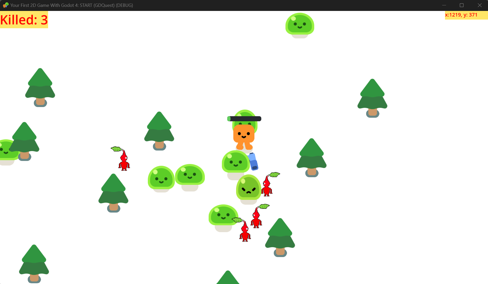
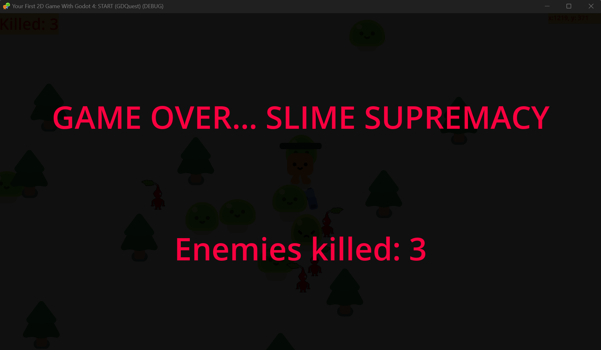

#  Godot-Vampire-Survivors-Tutorial

## Intro
I followed GDQuest's [guide](https://www.youtube.com/watch?v=GwCiGixlqiU).
I finished the tutorial, and the first commit is pretty much just following the tutorial exactly. Subsequent commits contain additional features.

## Ideas for things to implement
* Increase damage of enemies depending on time and enemies killed.

* Add a powerup.
* Add a second level.
* Randomly spawn trees/other objects in map
* Clean up the enemy code/use 'composition' better. Right now, lots of duplicated code between slime + pikmin code.
* Make different enemies do different damage.
* Use singletons to better share data

## Completed tasks
* Tutorial completed on **2/7/24**
* Counter + label added for enemies killed **2/10/24**
* Imported some of my [pixel art](https://github.com/kwilson33/Pixel-Art) (red pikmin) and got them animated in the game **2/10/24**
* Added additional enemies (red pikmin) **2/10/24**
* Added label to show x,y coordinates

---

### Screenshots
**Taken 2/10/24**
 
**Taken 2/10/24**
 
